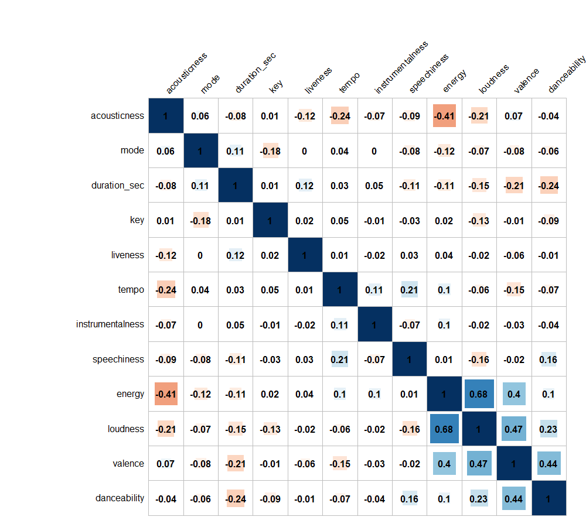
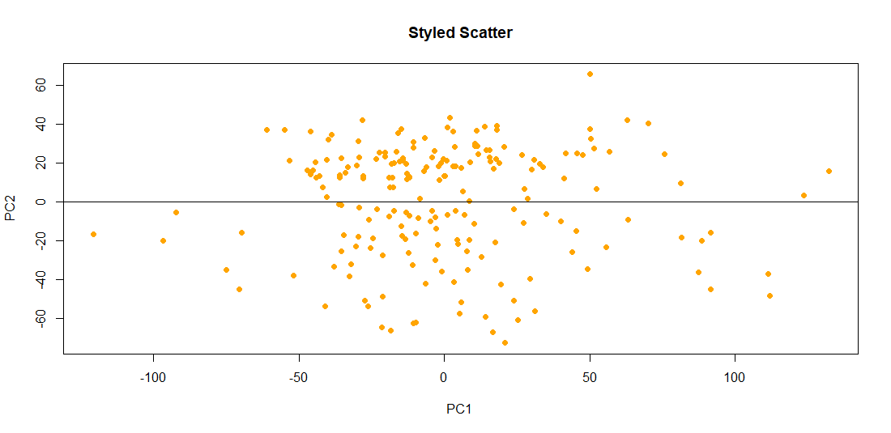
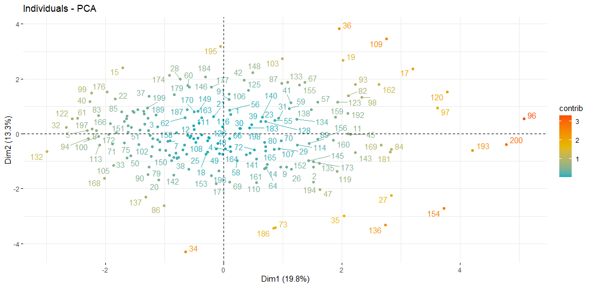
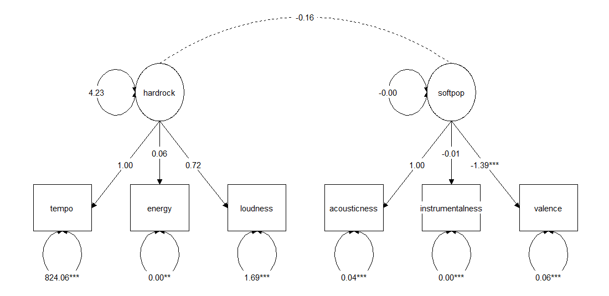

# Homework 3
## Q.2 Stroop, standing up or sitting down
### Fit an appropriate model to Stroop standing data

```{r setup, include=FALSE}
knitr::opts_chunk$set(echo = TRUE, message = FALSE, warning = FALSE)
```

let`s read the data!
``` {r Stroop, warning = FALSE, message = FALSE, fig.height = 2, fig.width = 2}

library(tidyverse)
library(ggplot2)
library(readr)
library(dplyr)

stroop_standing_data <- read_csv("R_homework/Homework_3/stroop_standing_data.csv")

View(stroop_standing_data)

str(stroop_standing_data)

df <- stroop_standing_data

summary(df)
```

1. Cleaning raw data =

```{r}
df %>%
  count(phase, stimulus)


newdf1 <- df %>% mutate(correct = ifelse(correct > 3 , NA , correct )) 

newdf1$stimulus[newdf1$stimulus == "XXX"] <- NA
newdf1$stimulus[newdf1$stimulus == "XXXX"] <- NA
newdf1$stimulus[newdf1$stimulus == "XXXXX"] <- NA

newdf1$congruency[newdf1$congruency == "baseline"] <- NA   #try with baseline too

newdf1$phase[newdf1$phase == "practice"] <- NA
newdf1$rt[newdf1$rt == "FALSE"] <- NA

newdf1$...11 <- NULL  #remove column

glimpse(newdf1)
```
2. Clean all NA
```{r}
sdf <- na.omit(newdf1)  #clean data set
```
```{r}
sdf$rt <- as.numeric(as.character(sdf$rt)) #character to numeric
```
```{r}
str(sdf)
```
3. Filter the data so we are only looking at correct trials / factors
```{r}
sdf <- sdf %>%
  filter(correct == 1)

sdf$congruency <- factor(sdf$congruency)  #factor
sdf$phase <- factor(sdf$phase)
```
4. Summarise the data to look at how accuracy varies across conditions and subject!
```{r}
sgrouping2 <- group_by(sdf, subject, condition , phase, congruency)
sdf_summary2 <- summarise(sgrouping2, mean_rt = mean(rt))

sgrouping3 <- group_by(sdf, condition , phase, congruency)
sdf_summary3 <- summarise(sgrouping3, mean_rt = mean(rt))
print.data.frame(sdf_summary3)

sdf_summary3$condition <- factor(sdf_summary3$condition) 
```
5. Plot the variables and interaction between factors
```{r}
par(mfrow = c(2,2))
interaction.plot(sdf_summary3$phase,sdf_summary3$congruency,sdf_summary3$mean_rt, main = "1", xlab = "Phase", ylab = "Reaction Time(s)", trace.label = "Congruency")
interaction.plot(sdf_summary3$phase,sdf_summary3$condition,sdf_summary3$mean_rt, main = "2", xlab = "Phase", ylab = "Reaction Time(s)", trace.label = "Condition")
interaction.plot(sdf_summary3$congruency,sdf_summary3$condition,sdf_summary3$mean_rt, main = "3",  xlab = "Congruency", ylab = "Reaction Time(s)", trace.label = "Condition")
par(mfrow = c(1,1))
```

* As seen in Chart 1, a faster response was given while sitting in the incongruent condition than standing, while the congruent condition was the opposite.

* Chart 2, trials started sitting or standing showed a faster response when the subjects continued in the same way as at the start, compared to the other conditions.

* In Graph 3, no matter how the trial started, congruent conditions had a faster response than incongruent conditions.

*Another graphic preference*
```{r}
par(mfrow = c(2,2))
boxplot(mean_rt~phase, data = sdf_summary3, main = "RT by Phase", xlab = "Phase", ylab = "Reaction Time(s)")
boxplot(mean_rt~congruency, data = sdf_summary3, main = "RT by Congruency", xlab = "Congruency", ylab = "Reaction Time(s)")
boxplot(mean_rt~condition, data = sdf_summary3, main = "RT by Condition", xlab = "Condition", ylab = "Reaction Time(s)")
par(mfrow = c(1,1))
```

_Let`s model the main effect_
```{r}
smodel1 = lm(mean_rt ~ ., data= sdf_summary3)
summary(smodel1) 

#or

smodel1 = lm(mean_rt ~ condition + phase + congruency , data= sdf_summary3)
summary(smodel1)
```

_Let`s add two-factor interactions_ When we add interactions to model, there will be decrease in proportion of main effects.As we see from data model, there is a significant effect of Congruency on reaction time.
```{r}
smodel2 = lm(mean_rt ~ .^2 , data= sdf_summary3)
summary(smodel2)
```

_Full model (3 factor) interaction = r2 equals 1 because all data varience equals 1_
```{r}
smodel3 = lm(mean_rt ~ .^3 , data= sdf_summary3)
summary(smodel3)
```

_We can also calculate specific interactions_ 
```{r}
smodel4 = lm(mean_rt ~ congruency + phase*condition , data= sdf_summary3)
summary(smodel4)
```

_ANOVA will give us same results too_
```{r}
aov1.out = aov(mean_rt ~ ., data= sdf_summary3) #main factors
summary(aov1.out)

aov2.out = aov(mean_rt ~ .^2 , data= sdf_summary3) #2 factor interaction
summary(aov2.out)

aov3.out = aov(mean_rt ~ .^3 , data= sdf_summary3) #whole pie
summary(aov3.out)

aov4.out = aov(mean_rt ~ congruency + phase*condition , data= sdf_summary3) #specific interaction
summary(aov4.out)
```

* some interaction plots
```{r}
sdf_summary2 %>% 
  ggplot(mapping = aes(x = subject, y = mean_rt, color = phase)) + facet_grid(~ condition*congruency) + geom_point() + theme_bw() + theme(legend.position = "bottom") + 
  stat_smooth(method = "lm") + scale_color_manual(values=c("darkorange", "purple"))
```

* distribution of the participants according to the experimental factors
```{r}
ggplot(sdf, aes(x = congruency, y = rt)) +
  geom_jitter(width = 0.1, height = 0, alpha = 0.25, aes(color = condition)) +
  facet_wrap(~ phase, nrow = 2) +
  theme_bw()
```


## Q.3 The Dimensions of Popular Music
### Applying PCA to the Top 200 songs from Spotify

1. Let start with reading data.
```{r Spotify, warning = FALSE, message = FALSE, fig.height = 2, fig.width = 2}
library(tidyverse)
library(ggplot2)
library(readr)
library(dplyr)
library(httr)
library(ggthemes)
library(factoextra)

spotify_clean <- read_csv("spotify_clean.csv")
View(spotify_clean)

spotify <- spotify_clean
glimpse(spotify)
```

2. Some trends:
```{r}
ggplot(spotify, aes(x=tempo)) + 
geom_histogram(aes(y=..density..),      # Histogram with density instead of count on y-axis
                 binwidth=.5,
                 colour="black", fill="white") +
geom_density(alpha=.2, fill="#FF6666") 

ggplot(spotify, aes(x=loudness)) + 
  geom_histogram(aes(y=..density..),      # Histogram with density instead of count on y-axis
                 binwidth=.5,
                 colour="black", fill="white") +
  geom_density(alpha=.2, fill="#FF6666") 
```

3. Lets look data correlation.
```{r}
library(corrplot)

dms <- select(spotify, danceability, energy, loudness, valence, acousticness, tempo, duration_sec, instrumentalness, key, liveness, mode, speechiness )

dms.cor = cor(dms)
dfs.cor <- data.frame(dms.cor)

#how to create matrix bar --> corrplot(dms.cor,method = 'square', order = 'AOE', addCoef.col = 'black', tl.col="black", tl.srt=45, cl.pos = 'n', col = COL2('RdBu'))
```




*As seen from the below correlation table, there is a significant correlation between energetic songs and loudness (0.68).* 
*There is no strong correlation between any 2 features.*

```{r}
palette = colorRampPalette(c("orange", "white", "red")) (20)
heatmap(x = dms.cor, col = palette, symm = TRUE)
```
*Another way of display matrix.*

4. Principal Component Analysis as Original 
```{r}
pca_dms1 <- prcomp(dms)
summary(pca_dms1)
factoextra::fviz_eig(pca_dms1) #plot
fviz_pca_var(pca_dms1, col.var="contrib")+
  scale_color_gradient2(low="darkgreen", mid="blue",
                        high="red", midpoint=20) +
  theme_test() # Control variable colors using their contributions
```

* 64% variance was explained by Principal component 1 and 35% was explained by Principal component 2.
* The element that explains the most variance in Dimension 1 is Duration time(sec).

```
attach(scores)
plot(x = scores$PC1 , y = scores$PC2, pch = 19, col = "orange", main="Styled Scatter",
     xlab="PC1 ", ylab="PC2") + 
abline(lm(PC2~PC1), col="black")
```

* the first component accounts for nearly all of the variance.

5. Better approach for him = Let1s remove Duration time.
```{r}
dms %>% select(-duration_sec) -> d_nodur
pca_nodur <- prcomp(as.matrix(d_nodur), scale = FALSE)
summary(pca_nodur)
factoextra::fviz_eig(pca_nodur) #plot
fviz_pca_var(pca_nodur, col.var="contrib")+
  scale_color_gradient2(low="darkgreen", mid="blue",
                        high="red", midpoint=20) +
  theme_test()
```
*Now, %98 of varience explained by Principal component!*

```{r}
#the downside
cor.test(pca_nodur$x[,1], dms$duration_sec)
```
*In our model, the statistics feature is not correlated with the other two*

### Now it is my turn ^ ^ This model comes to me meaningless.

1. Re-run, this time with scaling! (BECAUSE OUR VARIABLES NOT EQUAL IN SCALE)
```{r}
pca_dms2 <- prcomp(dms, center = TRUE, scale. = TRUE)
summary(pca_dms2)
factoextra::fviz_eig(pca_dms2) #plot
fviz_pca_var(pca_dms2,
             axes = c(1, 2),
             col.var="contrib",
             gradient.cols = c("#00AFBB", "#E7B800", "#FC4E07"), 
             repel = TRUE)

#Different dimension
fviz_pca_var(pca_dms2,
             axes = c(1, 3),
             col.var="contrib",
             gradient.cols = c("#00AFBB", "#E7B800", "#FC4E07"), 
             repel = TRUE)

#Different dimension
fviz_pca_var(pca_dms2,
             axes = c(2, 3),
             col.var="contrib",
             gradient.cols = c("#00AFBB", "#E7B800", "#FC4E07"), 
             repel = TRUE)
```
*Now all variables has contributed varience in some extend*

```{r}
# Contributions of variables to PC1/PC2/PC2
fviz_contrib(pca_dms2, choice = "var", axes = 1)
fviz_contrib(pca_dms2, choice = "var", axes = 2)
fviz_contrib(pca_dms2, choice = "var", axes = 3)
```

```
fviz_pca_ind(pca_dms2, col.ind = "contrib", 
             gradient.cols = c("#00AFBB", "#E7B800", "#FC4E07"),
             repel = TRUE)
```


2. Better approach for me : SCALED DATA (remove energy component)
```{r}
dms %>% select(-energy) -> d_nodur1
pca_nodur1 <- prcomp(as.matrix(d_nodur1), scale = TRUE)
summary(pca_nodur1)
factoextra::fviz_eig(pca_nodur1) #plot
fviz_pca_var(pca_nodur1, col.var="contrib")+
  scale_color_gradient2(low="darkgreen", mid="blue",
                        high="red", midpoint=10) +
  theme_test()
```


```{r}
#the downside
cor.test(pca_nodur1$x[,1], dms$energy)
```
*There is slight correlation between the statistics feature and other variables*

3. MY HYPOTHESIS : 
There may be 2 different hidden components playing a role in listening to the music. I divided them into 2 groups as HardRock and SoftPop.
hardrock; From fast, loud and noisy rhythms such as loudness, tempo, energy: Softpop; It consists of more musical and positive rhythms such as acousticness, instrumentalness, valence.

```{r}
d_my3 <- select(spotify, tempo, energy, loudness, acousticness, instrumentalness, valence )

pca_my3 <- prcomp(d_my3, scale = TRUE)
summary(pca_my3)
factoextra::fviz_eig(pca_my3) #plot

fviz_pca_var(pca_my3,
             axes = c(1, 2),
             col.var="contrib",
             gradient.cols = c("#00AFBB", "#E7B800", "#FC4E07"), 
             repel = TRUE)

fviz_pca_var(pca_my3,
             axes = c(1, 3),
             col.var="contrib",
             gradient.cols = c("#00AFBB", "#E7B800", "#FC4E07"), 
             repel = TRUE)


fviz_pca_var(pca_my3,
             axes = c(2, 3),
             col.var="contrib",
             gradient.cols = c("#00AFBB", "#E7B800", "#FC4E07"), 
             repel = TRUE)

fviz_contrib(pca_my3, choice="var", axes = 1)
fviz_contrib(pca_my3, choice="var", axes = 2)
fviz_contrib(pca_my3, choice="var", axes = 3)
```

4. Now we can test our hypothesis.
```{r}
library(lavaan)
song_type <- 'hardrock =~ tempo + energy + loudness
softpop =~ acousticness + instrumentalness + valence'

model_type <- cfa(song_type, d_my3)
summary(model_type)
```

```
library(tidySEM)
library(OpenMx)
graph_sem(model_type,
          layout = get_layout("", "hardrock", "", "", "softpop", "",
                              "tempo", "energy", "loudness", "acousticness", "instrumentalness", "valence",
                              rows = 2))
```


```
summary(model_type, fit.measures = TRUE) = This is very long summary (skip)
```
#### One rule of thumb is to look for RMSEA < 0.07 and CFI >= 0.9
```{r}
fitMeasures(model_type)["cfi"]

fitMeasures(model_type)["rmsea"]
```

#### Based on these measures, it seems like our hypothesis (that a hardrock and softpop- streaming song explains the variation in spotify 200 list) is not supported by the data.


